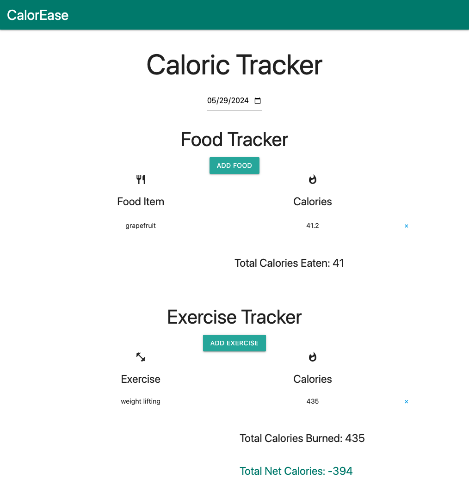

# NutritionTracker
Nutrition Tracker - CalorEase
- Repository - https://github.com/danielleboe/NutritionTracker
- Web App Link - https://danielleboe.github.io/NutritionTracker/

# Introduction
The application allows a user to track the food they've eaten and their daily exercise and calculate a total net calorie value to help users meet their health goals.

As a user,
I want to be able to add in food items their calories that I eat each day so that I can track my calorie intake to support my health.
Acceptance Criteria
GIVEN a nutritional tracker to manage my caloric intake
WHEN I open the webpage
THEN I am shown a list of the food items and their calories that I have logged, grouped by each day.
WHEN I open the webpage
THEN I am shown the total calories that I have consumed each day.
WHEN I open the webpage
THEN I am shown a button to add in additional items to track.
WHEN I click on the add new item button
THEN I am shown a form that asks for food item, calories, and day for each item.
WHEN I click on the x on each food item line
THEN that item deletes from the list and is removed from the total calorie count for the day.

# Built With
- [Materialize CSS Framework] (https://materializecss.com/)
- [Day.JS] (https://day.js.org/)
- APIs 
    - Food - https://api.calorieninjas.com/v1/nutrition 
    - Exercise - https://api.api-ninjas.com/v1/caloriesburned

# Usage

## Features
- Add new food entry (modal form)
- Automatically populate the calories of the food entered (API 1)
- Ability to delete record
- Calculate food calorie total for a day
- Calculate exercise total for a day
- Calculate total net calories for a day
- Swap between days
- Add exercise entry (modal form)
- Automatically populate the calories for the exercise entered (API 2)

## Screen Shots

## Contributors
- Danielle Boenisch
- Frank Stewart

## License

[MIT](https://choosealicense.com/licenses/mit/)